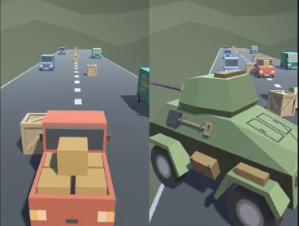

<h1> Unity Project </h1>

This repo is my unity learning roadmap.

Check all my submission, gameplay, project video, skills and badges.

### My profile URL: [Unity.com/sertacnn/profile](https://learn.unity.com/u/sertacnn/?tab=profile)

### My all submission: [unity.com/sertacnn/submission](https://learn.unity.com/u/sertacnn/?tab=submissions)

<h3> Table of Contents </h3>

_All contents have live gameplay/video and what i learned section_

- Create With Code 1
  - [Prototype 1](#prototype---1)
  - [Prototype 2](#prototype---2)
  - [Cube Challange - Playable](#cube-challenge)
- Create With Code 2
  - [Prototype 3 - Playable](#prototype---3)

 <h1>Create With Code 1 </h1>

### Prototype - 1

Video URL/more info: [Unity.com/submission](https://learn.unity.com/u/sertacnn/?tab=submissions)

### What I learned

- Local multiplayer gameplay.
- Input settings and project settings.
- Camera controller and basic character movement script.
- Rigidbody components.

### Prototype - 2

Video URL/more info: [Unity.com/submission](https://learn.unity.com/u/sertacnn/?tab=submissions)

### What I learned

- Game optimization. Destroy object when out of bound.
- InvokeRepeating(), Instantiate(), Destroy() methods.
- Write custom methods.
- Collider Components.
- Arrays with GameObject.
- Player horizontal and vertical bound options.
- MonoBehaviour OnTriggerEnter() method.
- Simple UI for game score/life scripts.
- Characters life bar (when objects shoot 3 projectile, destroy).
- Prefabs, Materials

## Cube Challenge

Gameplay URL: [play.unity](https://play.unity.com/mg/other/build-w8j) 
Video URL/more info: [Unity.com/submission](https://learn.unity.com/u/sertacnn/?tab=submissions)

### What I learned

- OpenGL build
- Unity build option for other platform
- Unity package manager

 <h1>Create With Code 2 </h1>

### Prototype - 3

Gameplay URL: [play.unity](https://play.unity.com/mg/other/builds-10-6) 
Video URL/more info: [Unity.com/submission](https://learn.unity.com/u/sertacnn/?tab=submissions)

### What I learned

- GetComponent
- ForceMode.Impulse
- Physics.Gravity
- Rigidbody constraints
- Rigidbody variables
- OnCollisionEnter()
- Repeat background
- Get Collider width
- Script communication
- CompareTag()
- Animation Controllers
- Animation States, Layers, and Transitions
- Animation parameters
- Animation programming
- SetTrigger(), SetBool(), SetInt()
- Particle systems
- Child object positioning
- Audio clips and Audio sources
- Play and stop sound effects
